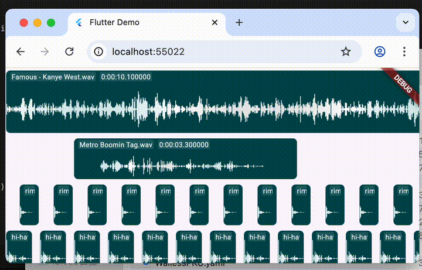

# WIP

# Track Maker

A Flutter media track view. Based on `two_dimensional_scrollables`. 



## Features

✨ **Two-dimensional scrolling** - Smooth scrolling in both horizontal and vertical directions  
🔍 **Zoom gestures** - Adjust timeline zoom through gestures or programmatically  
🎯 **Custom rendering** - Fully customizable track item appearance  

## Example

Run the example project:

```bash
cd example
flutter run
```

## License

This project is open source under the [MIT License](LICENSE).

